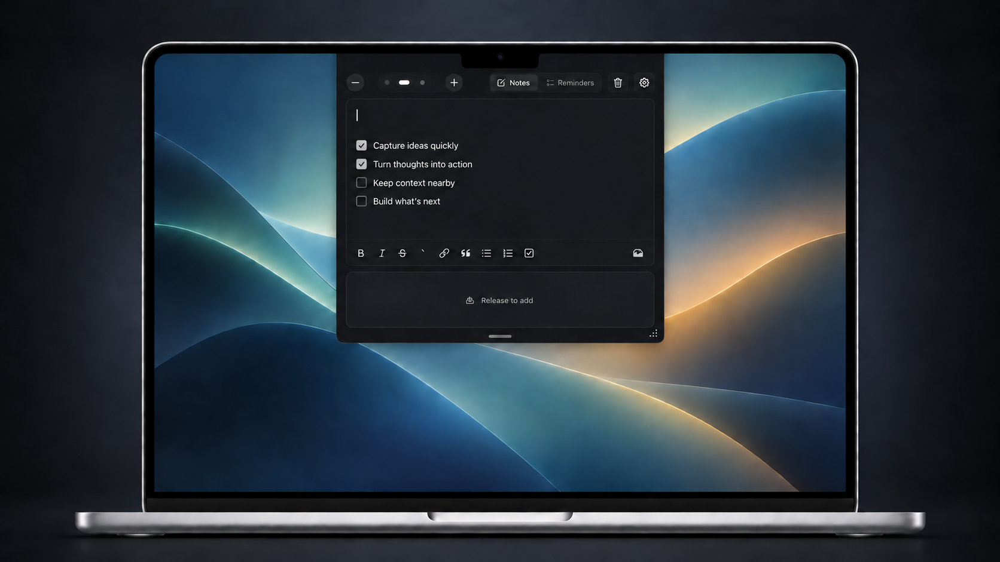
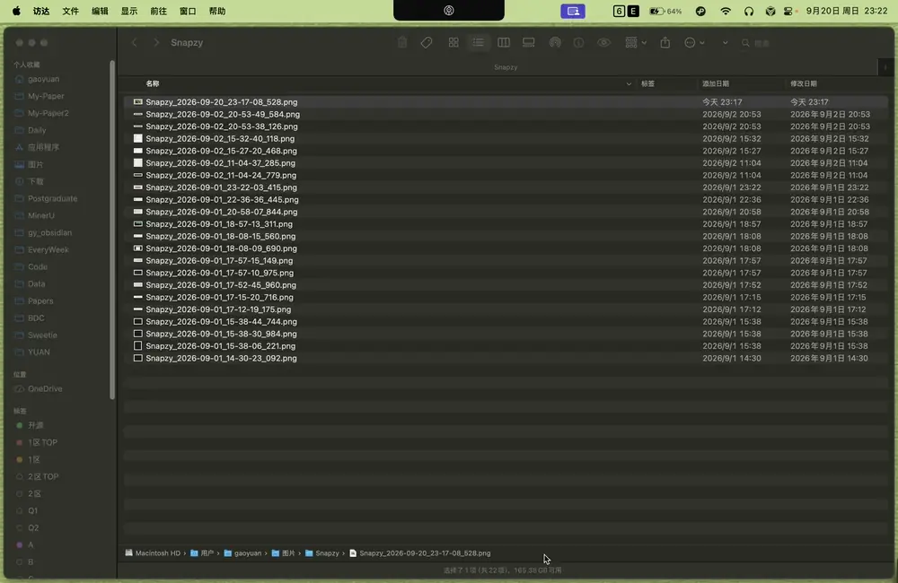

<p align="center">
  
</p>

# YUANNotch

一款藏在 Mac 屏幕顶部、尽量不打扰你的桌面记录与提醒应用。

YUANNotch 的出发点，是让记录尽可能自然、无感：平时安静地留在屏幕顶部，需要时随手展开，用完便回到正在做的事情里。它不是一个庞大的知识库或任务管理系统，而是一个始终在手边的入口——接住突然出现的想法、眼前要做的事，以及工作中需要反复查看的内容。

<p align="center">
  
</p>

## 使用演示

<p align="center">
  
</p>

<p align="center"><sub>演示会自动播放 · <a href="Resources/YUANNotch-Demo.mp4">查看高清 MP4</a></sub></p>

## 它能做什么

### 快速记录

脑海里刚出现一句话、一个思路或一段待整理的内容时，把鼠标移到屏幕顶部即可开始输入。笔记以 Markdown 文件保存在本地，也可以放进自己的 Obsidian 仓库。

### 同步提醒

直接查看、创建和完成 Apple 提醒事项，不必离开当前工作。提醒仍由 macOS 管理；使用 iCloud 列表时，也会通过 Apple 的服务同步到其他设备。

### 悬浮参考

面板可以从屏幕顶部拖出来，作为一张留在桌面上的便签。写作、整理资料或处理任务时，可以让需要对照的信息一直待在眼前。

### 文件暂存

把稍后还要使用的文件临时放进面板，需要时再拖到 Finder、其他应用或网页上传区域。暂存区只记住文件的位置，不会移动、复制或删除原文件。

## 如何使用

### 打开面板

默认情况下，把鼠标停在屏幕顶部中央即可展开 YUANNotch。也可以在 **设置 → Trigger** 中改为点击打开，并调整悬停触发的等待时间。

### 记录与提醒

在 Notes 页面直接输入即可开始记录；使用左上方的 `+` 和 `−` 新建或移除笔记页面。切换到 Reminders 页面后，可以查看、创建和完成 Apple 提醒事项。第一次启用时，需要在 **设置 → Integrations** 中打开同步，并授予系统提醒事项权限。

### 使用暂存区

暂存区默认启用，但没有文件时不会一直占用面板空间。将文件拖到屏幕顶部的 YUANNotch 区域或已经展开的面板，暂存区会自动出现。之后可以把文件从暂存区直接拖入其他应用；有暂存内容时，也可以点击编辑区下方的托盘图标收起或重新展开。

如果暂存区已被关闭，可以前往 **设置 → File Shelf**，打开 **Enable file shelf**。

### 拖出浮动与自动归位

- **拖出浮动：** 按住面板底部中央的灰色短线，向下拖动，面板就会脱离屏幕顶部，成为可以自由移动的悬浮窗口。
- **自动归位：** 双击灰色短线，或者把悬浮窗口拖到屏幕顶部，面板都会自动吸附回原位。

## 下载

[下载最新版本](https://github.com/Hy0IU/YUANNotch/releases/latest)

目前支持 macOS 14 或更高版本，以及 Apple Silicon Mac。

下载并解压 Release 中的 ZIP 安装包，再将应用拖入“应用程序”文件夹。当前版本尚未经过 Apple 公证；若首次打开时被 macOS 拦截，请前往“系统设置 → 隐私与安全性”，选择“仍要打开”。

## 数据与隐私

笔记以普通 Markdown 文件保存在本机，图片也存放在同一个笔记目录中。提醒事项直接读写 macOS 的系统提醒数据库。YUANNotch 不提供自己的账户、云端或同步服务。

## 从源码构建

需要 macOS 14+ 和 Swift 6：

```bash
git clone https://github.com/Hy0IU/YUANNotch.git
cd YUANNotch
bash Scripts/package-app.sh
```

## 致谢

- [swift-markdown-engine](https://github.com/nodes-app/swift-markdown-engine) 提供 Markdown 编辑器内核。
- [Atoll](https://github.com/Ebullioscopic/Atoll) 为 macOS 顶部面板的交互与实现提供了参考。
